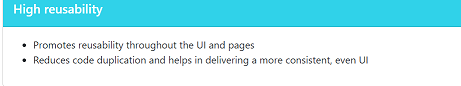
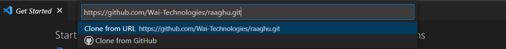
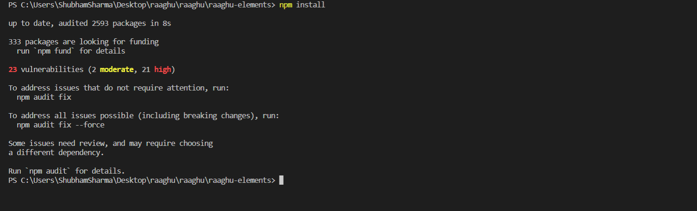

<!-- ALL-CONTRIBUTORS-BADGE:START - Do not remove or modify this section -->
<!-- ALL-CONTRIBUTORS-BADGE:END -->
<p align="center">
    <a href="https://raaghu.io" target="_blank">
        
    </a>
<p/>
<p>
<h1 align="center">Raaghu Micro-Frontend</h1>
<p/>

<p align="center">
    <a href="https://raaghu.io" target="blank">View Page</a>
    ·
    <a href="https://github.com/Wai-Technologies/raaghu/issues/new">Report Bug</a>
</p>

#  Introducing __`raaghu`__ 

__`raaghu`__ micro-frontend(mfe) is an angular based open-source software built with Bootstrap 5 and Storybook framework.raaghu mfe enables you to build complex components as well as UI layout by applying CSS to the inbuilt __`raaghu-elements`__, components and pages according to the wireframe design<br>
Micro front-end architecture breaks page designs into components that results in a high-level reusabiility, flexibility, with ease of maintainence.


#  Demo

Here is a quick [demo](https://user-images.githubusercontent.com/112168652/187441376-484413cc-b4a5-494f-b037-1a44796de26f.mp4) of the elements.


Share your appreciation to raaghu design system contributors with a ⭐️

#  Features

&emsp;    &emsp;     
<br><br>
&emsp;     &emsp;        
<br><br>
&emsp; &emsp; &emsp;&emsp;&emsp;&emsp; &emsp; &emsp;&emsp; &emsp; &emsp;&emsp; &emsp;&emsp; &emsp; <br>

#  Prerequisites for development

> #### To use the raaghu, you should be familiar with:
> - Angular
> - TypeScript
> - JavaScript
> - HTML
> - CSS

> #### To setup raaghu on your local system:
> - Node.js with NPM (Node Package Manager)
> - Angular-CLI (Command Line Interface)

#  How to Set up `raaghu-mfe` for Development?
You can run `raaghu-mfe` locally with a few easy steps.

1. Clone the repository

```bash
git clone https://github.com/Wai-Technologies/raaghu.git
```
<br />

2. Change the working directory
 
```bash
cd raaghu/raaghu-elements
```


3. Install dependencies

```bash
npm install
```
<br />

4. Change the working directory

```bash
cd raaghu/raaghu-mfe
```
<br />

5. Install dependencies

```bash
npm install
```

6. Synchronize raaghu-elements repository

```bash
npm run sync-elements
```
<br />
> **_NOTE:_** Above command will sync/copy raaghu-elements from public repository to the above local MFE project.

7. Patch Dev Server

```bash
npm run patch-dev-server
```
<br />

8. Build and serve

```bash
npm run start
```
<br />
9. Storybook


```bash
# View all pages and components and elements inside the storybook
npm run storybook 
```
<br />


##  Development support

1. Create a common Library

```bash
npm run lib <library_name>
```

2. Create a component

```bash
npm run page rds-components <component_name>
```

3. Create a screen / MFE

```bash
npm run mfe <mfe_name> <port_number>
```

4. Create a page within an existing MFE

```bash
npm run page <mfe_name> <page_name>
```


#  Built With
- [raaghu-elements Libraries](https://www.npmjs.com/package/rds-elements): Build bulletproof UI components faster
- [Bootstrap 5](https://bootstrap.com/): Sleek, intuitive, and powerful framework for faster and easier web development.
- [Storybook](https://storybook.js.org/): Build bulletproof UI components faster

#  License
This project is licensed under the MIT License - see the [`LICENSE`](LICENSE) file for details.


#  Contributing to `Raaghu`
Help us grow by contributing to raaghu micro front-end design system. 

 You can work on any features [listed here](https://github.com/Wai-Technologies/raaghu-elements#-upcoming-features)
 or create a custom one. After adding your code, please send us a Pull Request.  

#  Support

We all need support and motivation. `Raaghu` is not an exception. Please give this project a ⭐️ to encourage and show that you liked it. Don't forget to leave a star ⭐️ before you move away.

<h3 className="align">
A ⭐️ to <b>Raaghu</b> is to build its triceps 💪 stronger.
</h3>

## WAi Technology Contributors ✨

Thanks goes to these wonderful people and Wai technology.


